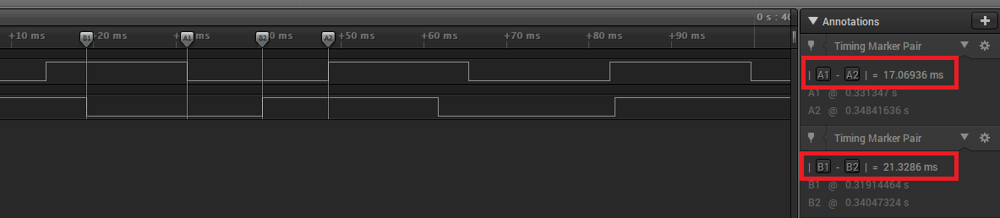

# TCC compare mode

This example shows how to use the TCC module in compare mode to generate different waveforms.

## Description

Three TCC channels are configured in compare mode. Each channel generates different output waveform depending upon configured action on compare match and period match.

**Normal Frequency Mode**: The waveform generation output (WO[x]) is toggled on each compare match between COUNT and CCx

**Match Frequency Mode**: The waveform generation output (WO[0]) is toggled on each time COUNT register is auto updated.

## Downloading and building the application

To clone or download this application from Github, go to the [main page of this repository](https://github.com/Microchip-MPLAB-Harmony/csp_apps_pic32cz_ca) and then click **Clone** button to clone this repository or download as zip file.
This content can also be downloaded using content manager by following these [instructions](https://github.com/Microchip-MPLAB-Harmony/contentmanager/wiki).

Path of the application within the repository is **apps/tcc/tcc_compare_mode/firmware** .

To build the application, refer to the following table and open the project using its IDE.

| Project Name      | Description                                    |
| ----------------- | ---------------------------------------------- |
| pic32cz_ca80_curiosity_ultra.X    | MPLABX Project for [PIC32CZ-CA80 curiosity ultra board](https://www.microchip.com/developmenttools/productdetails/)|
|||

## Setting up the hardware

The following table shows the target hardware for the application projects.

| Project Name| Board|
|:---------|:---------:|
| pic32cz_ca80_curiosity_ultra.X    | [PIC32CZ-CA80 curiosity ultra board](https://www.microchip.com/developmenttools/productdetails/)|
|||

### Setting up [PIC32CZ-CA80 curiosity ultra board](https://www.microchip.com/developmenttools/productdetails/)

- Connect the Debug USB port on the board to the computer using a micro USB cable

## Running the Application

1. Build and Program the application using its IDE
2. Observe generated waveforms on the oscilloscope

[PIC32CZ-CA80 curiosity ultra board](https://www.microchip.com/developmenttools/productdetails/)

| Timer Channel   | Pin      | Observable characteristic of the waveform
| ----------------| ---------| -----------------------------------------|
| TCC0_WO0 | PC00(Pin 11 of EXT1) | Toggle output every 21.33ms |
| TCC1_WO0 | PB10(Pin 7 of EXT1)  | Toggle output every 17.07ms |
||||

[PIC32CZ-CA80 Curiosity Ultra board](https://www.microchip.com/developmenttools/ProductDetails/) waveforms:

  
